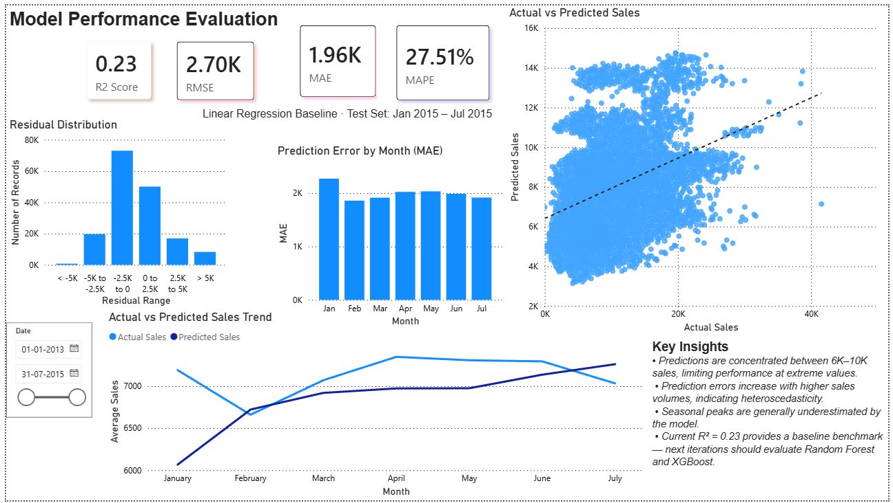
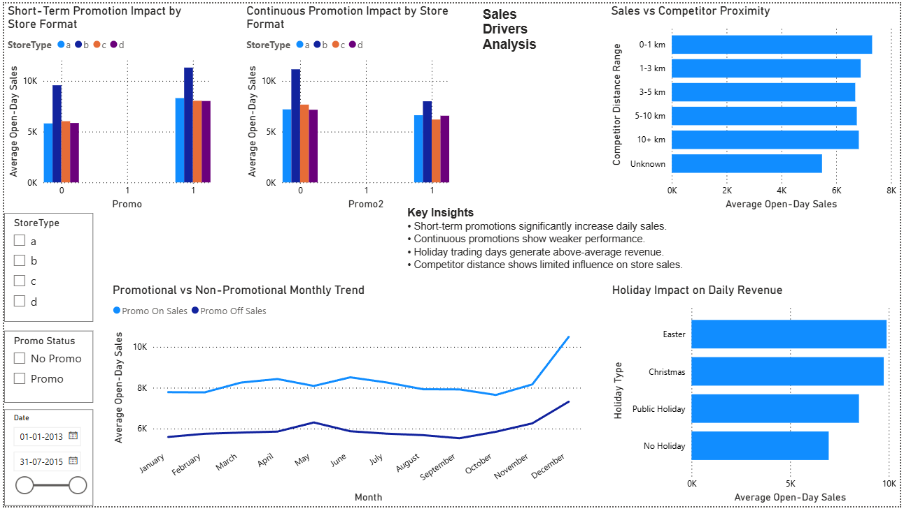
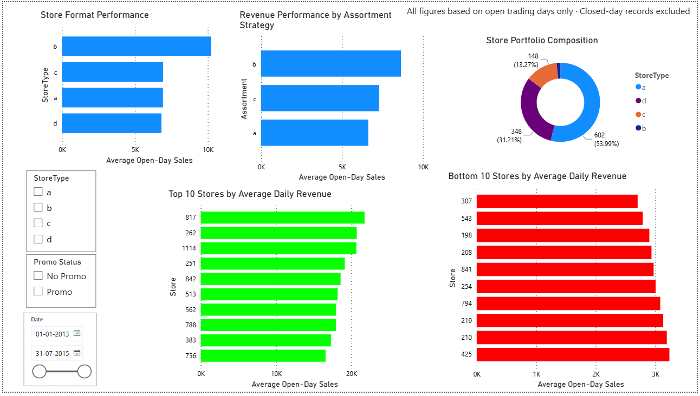
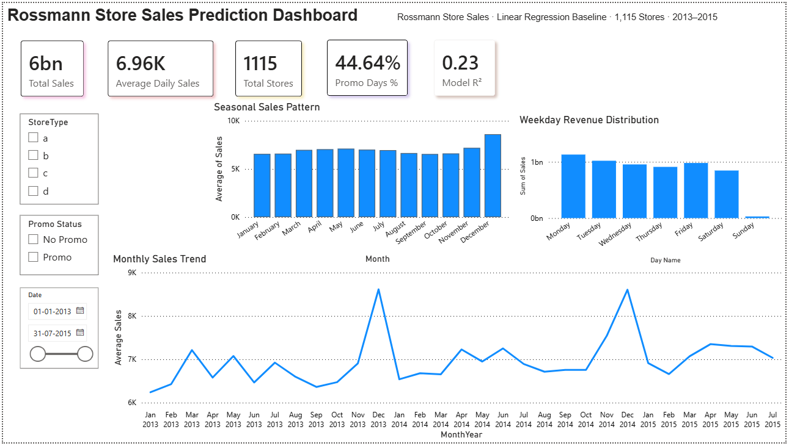

# Sales Prediction — Rossmann Store Sales

A machine learning project built as part of the **SparkIIT Data Science** internship program.  
This project predicts daily sales for Rossmann drug stores using exploratory data analysis, sales driver analysis, and regression modeling.

---

## 📊 Dashboard Preview

### Sales Overview


### Sales Drivers Analysis


### Store Performance Analysis


### Model Performance Evaluation


---

## 📁 Project Structure

```
Sales-Prediction/
├── Datasets/
│   └── rossmann-store-sales/
│       ├── train.csv
│       ├── test.csv
│       ├── store.csv
│       └── sample_submission.csv
├── dashboard/
│   ├── sales_dashboard.png
│   ├── sales_drivers.png
│   ├── store_performance.png
│   └── model_performance.png
├── Projects/
│   └── No_of_Orders.ipynb
├── model_evaluation.csv
└── Orders Report.pdf
```

---

## 📦 Dataset

**Rossmann Store Sales** — sourced from [Kaggle](https://www.kaggle.com/c/rossmann-store-sales)  
Contains historical sales data for **1,115 Rossmann drug stores** across Germany.

| File | Description |
|------|-------------|
| `train.csv` | Historical sales data with features |
| `test.csv` | Test set for prediction |
| `store.csv` | Supplemental store metadata |
| `sample_submission.csv` | Submission format |

---

## 🛠️ Tools & Libraries

- **Python** — Core programming language
- **Pandas & NumPy** — Data manipulation and analysis
- **Matplotlib & Seaborn** — Data visualization
- **Scikit-learn** — Machine learning modeling
- **Power BI** — Interactive dashboard creation

---

## 🔬 Methodology

1. **Data Loading** — Loaded Rossmann store sales dataset (train + store metadata)
2. **Exploratory Data Analysis (EDA)** — Seasonal patterns, weekday trends, promo impact
3. **Sales Drivers Analysis** — Promotion types, holiday effects, competitor proximity
4. **Store Performance Analysis** — Store format benchmarking, top/bottom performers
5. **Preprocessing** — Feature engineering, StandardScaler, 80/20 train-test split
6. **Model Training** — Linear Regression baseline model
7. **Evaluation** — R² Score, RMSE, MAE, MAPE; residual analysis; actual vs predicted trends
8. **Export** — `model_evaluation.csv` with predictions, residuals, and month labels

---

## 📈 Results

| Metric | Value |
|--------|-------|
| R² Score | 0.23 |
| RMSE | 2.70K |
| MAE | 1.96K |
| MAPE | 27.51% |
| Train Period | Jan 2013 – Dec 2014 |
| Test Period | Jan 2015 – Jul 2015 |

---

## 🔑 Key Findings

- **December** is the highest-revenue month; sales peak sharply before Christmas
- **Short-term promotions (Promo1)** significantly boost daily sales across all store formats
- **Continuous promotions (Promo2)** show weaker and diminishing performance
- **Store Type B** outperforms all other formats in average daily revenue
- **Competitor distance** has limited influence on store-level sales
- **Holiday periods** (Easter, Christmas) generate above-average revenue
- The model's predictions are concentrated between 6K–10K, underestimating seasonal peaks — indicating heteroscedasticity
- **Sunday** sees near-zero revenue (store closures)

---

## 🚀 Future Improvements

- Explore ensemble methods like **Random Forest** or **XGBoost** to push R² beyond 0.70
- Apply **feature engineering** to capture non-linear relationships (log-transform sales, interaction terms)
- Add **store-level embeddings** to account for individual store behaviour
- Hyperparameter tuning for improved accuracy

---

## 👤 Author

**Ayeshkant Ray**  
SparkIIT Data Science Program — April 2026
